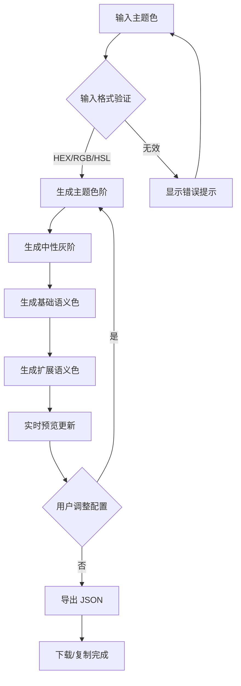

# 设计变量生成器 - 产品需求文档

## 1. 产品概述

**设计变量生成器**是一款专为设计师和开发者打造的 Web 工具，旨在快速生成符合 Tokens Studio 导入规范的设计系统颜色变量。

用户只需输入一个主题色，系统即可智能衍生出完整的颜色体系，包括主题色阶、黑白中性色、基础语义色（成功/危险/警告/信息）以及扩展语义色（背景、边框、文本等）。生成的变量可一键导出为 JSON 文件，直接导入 Figma 的 Tokens Studio 插件中使用。

**目标用户**：UI/UX 设计师、前端开发者、设计系统维护者

**核心价值**：大幅提升设计系统变量创建效率，确保颜色体系的一致性和可扩展性

## 2. 核心功能

### 2.1 功能模块

1. **主题色输入模块**
   - 支持 HEX、RGB、HSL 格式输入
   - 颜色选择器（可视化拾色器）
   - 预设主题色快捷选择

2. **色阶配置模块**
   - 自定义色阶数量（3-20 阶可选）
   - 预设色阶模板（5 阶、10 阶、13 阶）
   - 色阶命名规则配置（50-950 或自定义）

3. **颜色生成引擎**
   - 基于主题色的色阶生成（明暗变化）
   - 中性色（灰阶）生成
   - 基础语义色生成（success、danger、warning、info）
   - 扩展语义色生成（背景、边框、文本、阴影等）

4. **实时预览模块**
   - 完整配色预览面板
   - 各颜色类型分组展示
   - 颜色对比度和可访问性提示
   - 实际应用场景预览（按钮、卡片、文字）

5. **导出模块**
   - Tokens Studio 兼容 JSON 格式
   - 标准 Design Token JSON 格式
   - 一键复制到剪贴板
   - 文件下载

### 2.2 页面详情

| 页面模块 | 模块名称 | 功能描述 |
|---------|---------|---------|
| 主界面 | 顶部导航栏 | 工具名称、导出按钮、主题切换 |
| 主界面 | 主题色输入区 | 颜色输入框、颜色选择器、预设色板 |
| 主界面 | 配置面板 | 色阶数量滑块、命名规则选择 |
| 主界面 | 预览区域 | 实时更新的配色预览，包含所有生成的颜色 |
| 主界面 | 颜色详情卡片 | 每个颜色的 HEX 值、变量名、复制按钮 |
| 主界面 | 导出面板 | JSON 预览、复制/下载按钮 |

## 3. 核心流程

### 3.1 主流程

```
用户输入主题色
    ↓
系统实时生成颜色体系
    ↓
预览面板展示所有颜色
    ↓
用户调整色阶配置（如需要）
    ↓
用户点击导出
    ↓
生成 JSON 文件并下载/复制
```

### 3.2 流程图



## 4. 用户界面设计

### 4.1 设计风格

**设计理念**：专业工具感 + 极简美学

**配色方案**：
- 主色：#6366F1（品牌紫）
- 背景：深色主题（#0F172A 为主，#1E293B 为卡片背景）
- 文字：#F8FAFC（主文字）、#94A3B8（次要文字）
- 边框：#334155
- 强调色：与用户输入的主题色保持视觉和谐

**字体选择**：
- 标题：Inter（现代、专业）
- 正文：Inter
- 代码/变量名：JetBrains Mono

**布局风格**：
- 单页应用，左右分栏
- 左侧：输入和配置（固定宽度 360px）
- 右侧：预览和导出（弹性宽度）
- 卡片式设计，圆角 12px
- 微妙阴影和边框分隔

### 4.2 页面设计概览

| 区域 | 模块名称 | UI 元素 |
|------|---------|---------|
| 顶部 | 导航栏 | Logo、标题"Design Tokens Generator"、导出按钮 |
| 左侧 | 颜色输入区 | 输入框、颜色选择器、预设色块网格 |
| 左侧 | 配置区 | 滑块、选择器、标签页 |
| 右侧 | 预览面板 | 颜色网格、分类折叠面板 |
| 右侧 | 导出区 | JSON 代码块、复制/下载按钮 |

### 4.3 响应式设计

- **桌面优先**（最小宽度 1024px）
- 平板模式（768px-1024px）：左右分栏调整为上下布局
- 移动端（<768px）：单列布局，折叠面板

### 4.4 交互设计

- **实时预览**：输入主题色后 300ms 防抖，自动更新预览
- **颜色卡片悬停**：放大效果 + 显示复制按钮
- **复制成功**：Toast 提示 "已复制到剪贴板"
- **导出动画**：按钮点击后加载状态，然后显示成功图标

## 5. 技术约束

- 使用 React 18 框架
- Vite 作为构建工具
- TailwindCSS 作为样式方案
- 支持现代浏览器（Chrome、Firefox、Safari、Edge 最新版）
- 无需后端，纯前端应用
- 本地存储用户偏好设置（可选）
